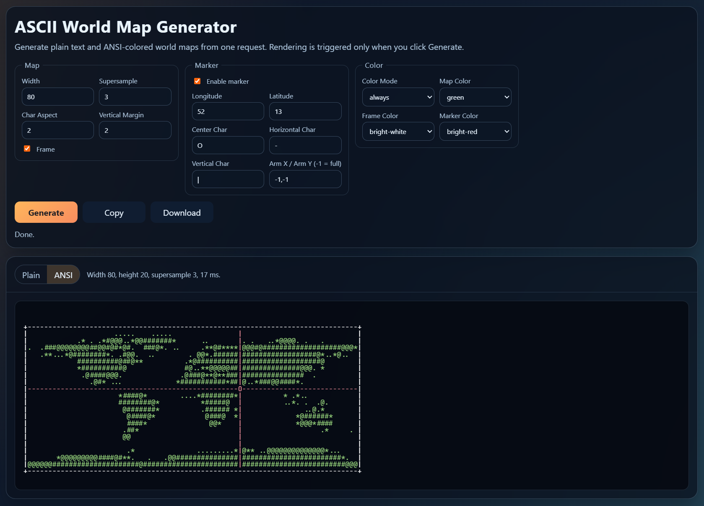

# ASCII World Map Generator

Small MVP web app for generating ASCII world maps from your browser.

It wraps `github.com/Kivayan/map-ascii` with a Go API, then serves a static Astro UI through Caddy. The browser talks to `/api` on the same origin, so there is no CORS setup.

Visit the page at [https://ascii-map.kivayan.com](https://ascii-map.kivayan.com) or run locally with Docker.



## What this project does

- Renders world maps as plain ASCII text.
- Optionally renders ANSI-colored output in the same request.
- Exposes map controls for width, supersample, char aspect, margin, frame, marker, and colors.
- Provides copy/download actions from the UI.

## Architecture

- `api/`: Go HTTP server
  - `POST /api/generate`
  - `GET /api/healthz`
- `web/`: Astro static page + client-side JS
- `deploy/Caddyfile`: static file serving and reverse proxy
- `docker-compose.yml`: local two-container setup (`web` + `api`)

Request flow:

1. Browser loads UI from `web` (Caddy).
2. UI sends JSON to `/api/generate`.
3. Caddy proxies `/api/*` to the Go API (`api:8081`).
4. API validates input, renders map(s), and returns JSON.

## Run locally

```bash
docker compose up --build
```

Open `http://localhost:8080`.

## API example

`POST /api/generate`

```json
{
  "width": 120,
  "supersample": 3,
  "char_aspect": 2,
  "margin": 2,
  "frame": true,
  "marker": {
    "enabled": false,
    "lon": 0,
    "lat": 0,
    "center": "O",
    "horizontal": "-",
    "vertical": "|",
    "arm_x": -1,
    "arm_y": -1
  },
  "color": {
    "mode": "always",
    "map_color": "green",
    "frame_color": "bright-white",
    "marker_color": "bright-red"
  }
}
```

Response shape:

```json
{
  "plain": "...",
  "ansi": "...",
  "meta": {
    "width": 120,
    "height": 30,
    "supersample": 3,
    "char_aspect": 2,
    "duration_ms": 52,
    "bytes": 3810
  }
}
```

## Runtime safeguards

- Width limits: `20..240` by default
- Supersample limits: `1..5`
- Char aspect limits: `1.0..3.5`
- Rate limiting: `20` requests per minute per client key (in-memory)
- Request body size cap (default `64 KiB`)
- HTTP server timeouts for header read, read, write, and idle connections

## Useful local commands

```bash
# run API without Docker
cd api && go run ./cmd/server

# build frontend only
cd web && npm ci && npm run build
```
